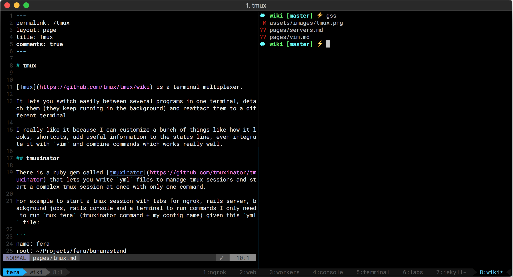

# Tmux

It let you switch easily between several programs in one terminal, detach them \(keep them running in the background\) and reattach them to a different terminal.

I really like it because I can customize a bunch of things like how it looks, shortcuts, add useful information to the status line, even integrate it with `vim` and combine commands which works really well.



## tmuxinator

There is a ruby gem called [tmuxinator](https://github.com/tmuxinator/tmuxinator) that lets you write `yml` files to manage tmux sessions and start a complex tmux session at once with only one command.

For example to start a tmux session with tabs for ngrok, rails server, background jobs, rails console and a terminal to run commands I only need to run `mux fera` \(tmuxinator command + my config name\) given this `yml` file:

```text
name: fera
root: ~/Projects/fera/bananastand
startup_window: terminal

windows:
  - ngrok: ngrok http 3000
  - web: bundle exec rails server
  - workers: foreman start -f Procfile-Workers
  - console: bundle exec rails c
  - terminal: echo 'you can use shell commands'
  - labs: open /Applications/Spotify.app ; open /Applications/Slack.app ; labs
```

Tmuxinator is specially useful when you switch between projects quite often which is not my case anymore, but I still use it because it’s easy.  


## tmux-plugins

Tmux has a [tmux plugin manager](https://github.com/tmux-plugins/tpm) \(tpm\) to add more features to it or to change how it looks.

In my case, I just use it to change how it looks using this config:

```text
set -g @themepack 'powerline/default/cyan'

# List of plugins
set -g @plugin 'tmux-plugins/tpm'
set -g @plugin 'tmux-plugins/tmux-sensible'
set -g @plugin 'jimeh/tmux-themepack'

# initialize tmux plugin manager
run '~/.tmux/plugins/tpm/tpm'
```

You can find more plugins [here](https://github.com/tmux-plugins).

## **my config files for**

* [tmux](https://github.com/lucasprag/dotfiles/blob/master/tmux.conf)
* [tmuxinator](https://github.com/lucasprag/dotfiles/tree/master/tmuxinator)

## **books**

* [The Tao of tmux](https://leanpub.com/the-tao-of-tmux/read) by [Tony Narlock](https://github.com/tony)

